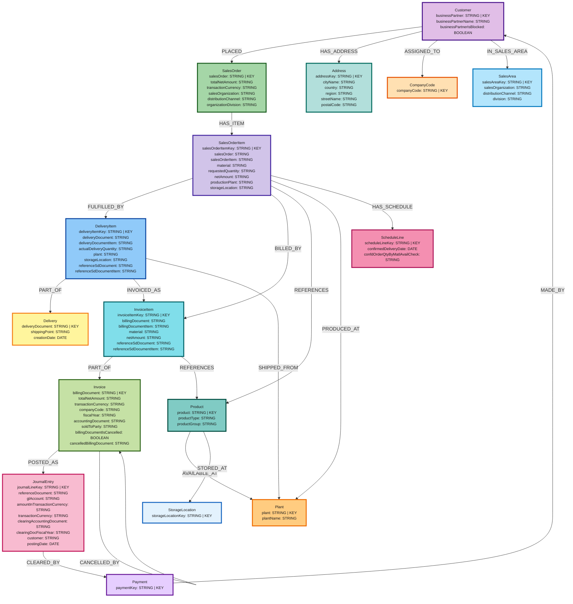

# SAP O2C Context Graph — data model (Mermaid)

Generated from [`o2c_data_model.json`](o2c_data_model.json) using the Neo4j data modeling MCP tool `get_mermaid_config_str`. Node colours follow the project O2C reference ERD palette (customer purple, order green, logistics blue/yellow, finance pink/cyan, master data teal/orange).

To regenerate the **graph structure** after editing the JSON model, call MCP **`user-mcp-data-modeling`** → **`get_mermaid_config_str`** with `data_model` set to the contents of `o2c_data_model.json`, then re-apply the `%% Styling` block above (MCP output uses generic colours).
